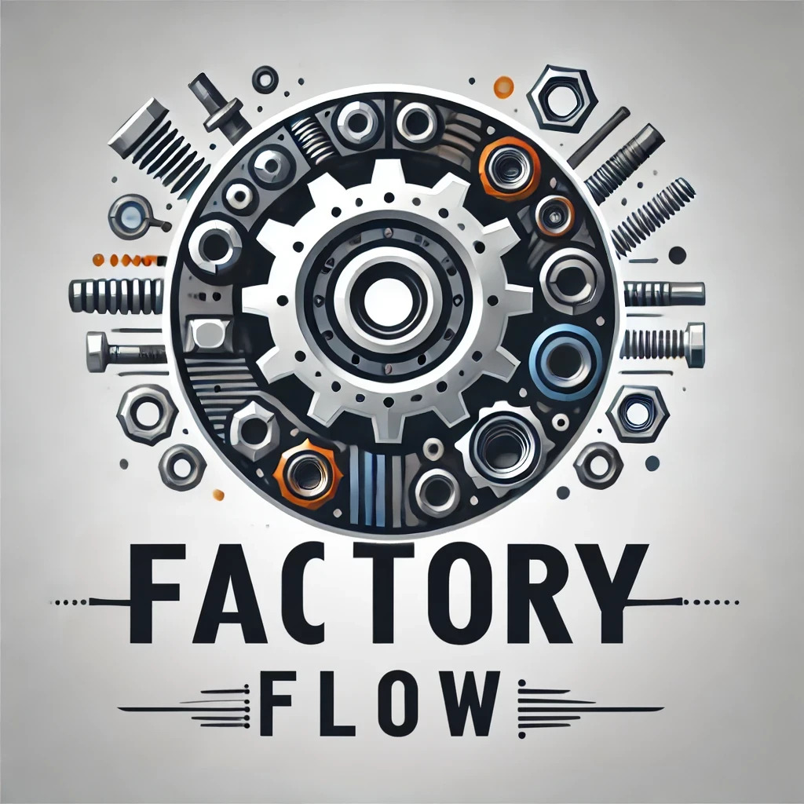

# Factory Flow

**Factory Flow** is a project developed as part of our final programming project. It is an application designed to manage the maintenance of production machines in a spare parts manufacturing factory. This project is developed using Java EE with a RESTful architecture and leverages modern technologies to deliver a robust and efficient solution.

---

## Team

- **Terry Henrard**
- **Albrecq Gary**
- **Marain Dimitri**

---

## Technologies Used

- **Main Language**: Java EE (JEE)
- **Application Server**: Apache Tomcat 9.0
- **Database**: Oracle XE
- **Dependency Manager**: Maven
- **Backend**: RESTful API for CRUD operations and data management

---

## Key Features

- **Machine Management**:
  - Create, update, and delete machines
  - Manage detailed information for each machine (serial number, status, etc.)
- **Maintenance Tracking**:
  - Record maintenance interventions
  - Manage technicians and their schedules
  - Notifications for upcoming maintenance
- **Reports**:
  - Generate reports on maintenance history
  - Analyze machine breakdowns and performance
- **Security**:
  - Manage user roles (administrators, technicians, supervisors)
  - Secure authentication via the RESTful API

---

## Project Structure

### Backend

- **RESTful architecture** with endpoints to manage machines, technicians, and interventions.
- Implemented using servlets and business services in JEE.
- Connected to an Oracle XE database to store data.
- Dependency management handled by Maven.

### Frontend

- **JSP¨**.

---
